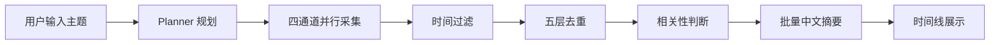

# 信息监控 Agent

一个面向“主题监控”的智能信息采集与摘要 Agent。用户只需要输入一个主题，系统会自动完成关键词生成、多通道采集、时间过滤、去重、相关性判断、中文摘要和时间线展示。

## 核心能力

- Planner 自动拆解主题，生成标签、搜索词、RSS 源和网页源
- 四通道并行采集
  - 英文搜索：Tavily
  - 中文搜索：Tavily
  - RSS 源：主流媒体、技术博客、官方博客
  - 网页/官方源：普通网页、官方站点、GitHub 仓库 release 和 commit
- 按“最新、最近、近期”自动做时间过滤
- 五层去重，降低重复信息
- 二元相关性判断，减少无关结果
- 批量生成 2-3 句中文摘要
- 结果按时间线展示
- 同时提供 Web 界面和 Textual 终端界面

## 工作流程



## 技术栈

- Python
- FastAPI + WebSocket
- HTML / CSS / JavaScript
- Textual
- OpenAI 兼容 LLM API
- Tavily Search API
- GitHub REST API
- feedparser
- trafilatura
- httpx
- rapidfuzz

## 项目结构

```text
monitor-agent/
├── src/
│   ├── agent/                 # 采集 Agent
│   ├── infrastructure/        # LLM 客户端
│   ├── pipeline/              # 规划、过滤、去重、相关性、摘要、时间线
│   ├── sources/               # Tavily、RSS、Web、GitHub 数据源
│   ├── tui/                   # Textual 界面
│   ├── web/                   # FastAPI Web 界面
│   ├── config.py
│   ├── models.py
│   └── prompts.py
├── tests/                     # 单元测试
├── docs/                      # 设计和方案文档
├── sources.json               # 可配置信息源
├── requirements.txt
├── run_monitor.cmd
└── run_web.cmd
```

## 快速开始

### 1. 安装依赖

```powershell
cd monitor-agent
python -m venv .venv
.\.venv\Scripts\activate
pip install -r requirements.txt
```

### 2. 配置环境变量

复制并填写：

```powershell
Copy-Item .env.example .env
```

主要配置：

| 变量 | 说明 |
| --- | --- |
| `LLM_API_KEY` | 大模型 API Key |
| `LLM_BASE_URL` | OpenAI 兼容接口地址 |
| `LLM_MODEL` | 模型名称 |
| `TAVILY_API_KEY` | Tavily 搜索 API Key |
| `GITHUB_API_KEY` | GitHub API Token，可选，用于提升请求额度 |
| `RSS_FEEDS` | 额外 RSS 源，逗号分隔 |
| `SOURCES_FILE` | 信息源配置文件 |
| `KEYWORD_FILTER_FILE` | 可选关键词过滤文件 |

### 3. 启动 Web 界面

```powershell
.\run_web.cmd
```

或者手动启动：

```powershell
.\.venv\Scripts\python.exe -m uvicorn src.web.app:app --host 127.0.0.1 --port 8000
```

访问：

```text
http://127.0.0.1:8000
```

### 4. 启动 Textual 界面

```powershell
.\run_monitor.cmd
```

## 主要流程说明

1. **Planner** 根据用户主题生成标签、查询词，并选择 RSS、网页和官方 GitHub 仓库。
2. **采集 Agent** 使用 function calling 自动调用搜索、RSS、网页和 GitHub 工具。
3. **时间过滤** 根据主题中的时间词保留近期内容。
4. **去重** 使用标题相似度、内容 Jaccard 相似度和 URL 归一化等多层策略。
5. **相关性判断** 使用二元结果决定保留或丢弃。
6. **摘要生成** 按批次调用大模型，输出简洁中文摘要。
7. **时间线** 将最终结果按发布时间分组展示。

## 测试

```powershell
.\.venv\Scripts\python.exe -m pytest -q
```

## 安全说明

- `.env` 已被 `.gitignore` 忽略
- 仓库中只保留 `.env.example`
- 不要提交任何真实 API Key
- GitHub Token 建议使用 `public_repo` 权限，只读取公开仓库
