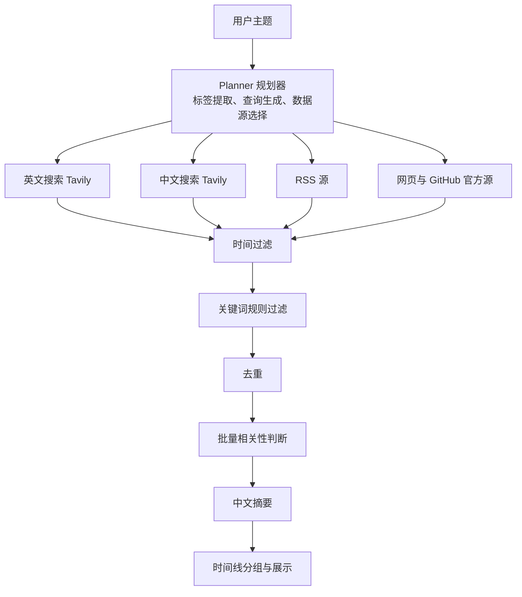

# MonitorAgent

<div align="center">

一个从 0 实现的信息监控 Agent。你只需要像聊天一样输入一个主题，系统就会自动完成主题规划、多通道采集、规则过滤、去重、相关性筛选和中文摘要，最后按时间线把结果整理好。

MonitorAgent 同时提供 **终端 TUI** 和 **Web 界面** 两种使用方式，共享同一套采集与处理流水线。

</div>

## 界面预览

<div align="center">
  
  <p>Web 界面：输入主题后实时展示采集进度、规划信息和结果时间线</p>
</div>

<div align="center">
  
  <p>终端 TUI：在命令行中完成相同的信息监控流程</p>
</div>

## 项目概述

MonitorAgent 是一个聚焦于“信息监控”的小型智能体系统。相比传统的信息看板或固定关键词订阅，它用大模型把用户模糊的自然语言主题，转化成可执行的采集计划，并用多种来源把真实信息聚合成一条清晰的时间线。

它的目标不是堆砌数据，而是把“某个主题最近发生了什么、哪些内容真正相关”这件事，尽可能做到完整、准确、容易阅读。

## 核心能力

- **AI 主题规划**：从主题中提取兴趣标签、关键词、中英文搜索词，并选出合适的 RSS 与网页来源。
- **多通道并行采集**：同时使用 Tavily 搜索、RSS/Atom/JSON Feed、网页正文和 GitHub Releases/Commits 获取信息。
- **确定性的后处理**：时间过滤、关键词规则过滤、去重和时间线分组不依赖大模型，结果稳定可复现。
- **大模型相关性筛选**：对采集到的内容进行批量相关性判断，只保留真正相关的条目。
- **中文摘要**：为保留的条目生成简洁的中文摘要，理解成本低。
- **双界面**：终端 TUI 和 Web UI 共享同一套流水线，本地运行即可使用。
- **可扩展数据源**：通过 `sources.json` 集中维护 RSS 与网页来源，随时增减。

## 一次完整运行

| 步骤 | 阶段 | 主要操作 | 参与组件 |
| --- | --- | --- | --- |
| 1 | 用户提问 | 用户在 TUI 或 Web 中输入主题 | TUI / Web |
| 2 | 主题规划 | 调用 LLM 提取标签、关键词、查询词与数据源 | `planner` |
| 3 | 构建通道 | 生成英文搜索、中文搜索、RSS、网页四个可选通道 | `orchestrator` |
| 4 | 并行采集 | 各通道独立执行有界工具循环，产出结构化条目 | `collector` |
| 5 | 时间过滤 | 按主题解析出的时间窗口过滤过旧内容 | `time_filter` |
| 6 | 规则过滤 | 按关键词规则文件快速硬过滤 | `keyword_filter` |
| 7 | 去重 | 根据 URL、标题相似度、正文相似度合并重复项 | `dedup` |
| 8 | 相关性筛选 | 按标签批量判断是否与主题相关 | `relevance` |
| 9 | 中文摘要 | 为相关条目批量生成中文摘要 | `summary` |
| 10 | 时间线展示 | 按发布时间倒序、按天分组，缺失时间排最后 | `timeline` / TUI / Web |

## 架构与数据流



核心设计原则：

- **采集归采集，处理归处理**：采集阶段由大模型驱动的 Agent 负责探索，后处理阶段用确定性代码保证质量。
- **单条来源失败不拖垮整体**：某个 RSS 或网页抓取失败时只影响该来源，不会让整个运行中断。
- **预算受控**：每个采集通道都有最大工具轮数和最大搜索次数，避免无界调用。

## 目录结构

```text
monitor-agent/
  .env.example              # 环境变量模板
  requirements.txt          # Python 依赖
  run_monitor.cmd           # 启动 TUI
  run_web.cmd               # 启动 Web 服务并打开浏览器
  sources.json              # 候选 RSS 和网页来源
  picture/                  # README 示例截图
  src/
    config.py               # 配置读取
    models.py               # 核心数据模型
    prompts.py              # 大模型提示词
    utils.py                # JSON 解析与清洗工具
    infrastructure/
      llm_client.py         # OpenAI 兼容 LLM 客户端
    sources/
      base.py               # HTML、日期等基础工具
      registry.py           # sources.json 读取
      tavily.py             # Tavily 搜索
      rss.py                # RSS/Atom/JSON Feed
      web.py                # 网页正文抓取
      github.py             # GitHub Releases 和 Commits
    agent/
      collector.py          # 采集 Agent 与工具循环
    pipeline/
      planner.py            # 主题规划
      orchestrator.py       # 流水线编排
      time_filter.py        # 时间窗口解析与过滤
      keyword_filter.py     # 关键词规则过滤
      dedup.py              # 去重
      relevance.py          # 相关性判断
      summary.py            # 中文摘要
      timeline.py           # 时间线分组
    tui/
      tui_app.py            # Textual 终端界面
    web/
      app.py                # FastAPI 与 WebSocket 服务
      static/               # Web 前端资源
  tests/                    # 单元测试
```

## 快速开始

### 环境要求

- Python 3.13 或更高版本
- OpenAI 兼容的 LLM API，或 OpenAI 官方 API
- Tavily API Key，用于中英文搜索通道
- 可访问外部网络的运行环境

### 安装依赖

在 PowerShell 中执行：

```powershell
python -m venv .venv
.\.venv\Scripts\Activate.ps1
pip install -r requirements.txt
```

### 配置环境变量

项目使用 `.env` 保存配置。首次运行时可以先复制模板：

```powershell
if (!(Test-Path .env)) { Copy-Item .env.example .env }
```

然后编辑 `.env`，至少需要配置：

```dotenv
LLM_API_KEY=你的模型 API Key
LLM_BASE_URL=可选的 OpenAI 兼容接口地址
LLM_MODEL=大模型名称

TAVILY_API_KEY=你的 Tavily API Key
GITHUB_API_KEY=可选的 GitHub API Key
```

### 启动 TUI

```powershell
.\run_monitor.cmd
```

也可以直接运行：

```powershell
.\.venv\Scripts\python.exe -m src.tui.tui_app
```

在输入框中输入主题并按 `Enter`。常用快捷键：

- `Ctrl+Q`：退出
- `Ctrl+H`：收起或展开全部采集面板

### 启动 Web 界面

```powershell
.\run_web.cmd
```

脚本会启动服务并尝试打开浏览器。也可以手动运行：

```powershell
.\.venv\Scripts\python.exe -m uvicorn src.web.app:app --host 127.0.0.1 --port 8000
```

然后访问：

- 首页：<http://127.0.0.1:8000>
- WebSocket：<ws://127.0.0.1:8000/ws>

### 使用示例

可以输入自然语言主题，例如：

- `监控 OpenAI 最近的重要产品更新`
- `整理过去 7 天 GitHub 上 React 的重要提交`
- `关注本周大模型行业动态`
- `搜索并汇总最近关于量子计算的最新进展`

主题中如果包含时间表述，系统会尝试解析为时间窗口。支持的形式包括“最近 5 天”“近 7 天”“本周”“本月”等。

## 配置项

以下配置在 `.env` 中设置：

| 变量 | 默认值 | 是否必填 | 说明 |
| --- | --- | --- | --- |
| `LLM_API_KEY` | 空 | 是 | OpenAI 兼容接口的 API Key |
| `LLM_BASE_URL` | 空 | 否 | OpenAI 兼容接口地址，留空使用官方接口 |
| `LLM_MODEL` | `空` | 否 | 使用的模型名称 |
| `LLM_TIMEOUT` | `180` | 否 | LLM 请求超时时间，单位秒 |
| `TAVILY_API_KEY` | 空 | 搜索通道需要 | Tavily 搜索 API Key |
| `GITHUB_API_KEY` | 空 | 否 | GitHub API Key，可提高请求限额 |
| `RSS_FEEDS` | 空 | 否 | 额外 RSS 地址，多个地址用逗号分隔 |
| `SOURCES_FILE` | `sources.json` | 否 | 候选来源配置文件路径 |
| `KEYWORD_FILTER_FILE` | 空 | 否 | 关键词过滤规则文件路径，留空表示关闭 |
| `MAX_SEARCH_ROUNDS` | `4` | 否 | 每个采集 Agent 的最大工具调用轮数 |
| `MAX_WEB_SEARCHES` | `6` | 否 | 每个搜索通道的最大搜索次数 |
| `MAX_RESULTS_PER_SOURCE` | `8` | 否 | 单次 Tavily 搜索的最大结果数 |
| `RELEVANCE_THRESHOLD` | `0.8` | 否 | 相关性阈值，当前二分类实现中暂未直接参与过滤 |
| `CLASSIFY_BATCH_SIZE` | `20` | 否 | 相关性判断和摘要的批处理大小 |
| `TITLE_SIM_THRESHOLD` | `0.90` | 否 | 标题相似去重阈值 |
| `CONTENT_JACCARD_THRESHOLD` | `0.88` | 否 | 正文 Jaccard 去重阈值 |
| `MIN_TAGS` | `5` | 否 | 规划器最少生成的标签数 |
| `MAX_TAGS` | `12` | 否 | 规划器最多保留的标签数 |
| `REQUEST_TIMEOUT` | `30` | 否 | RSS、网页、GitHub 请求超时时间 |
| `MAX_RETRIES` | `2` | 否 | LLM 客户端最大重试次数 |

## 去重实现

去重逻辑位于 `src/pipeline/dedup.py`，在时间过滤和关键词过滤之后、相关性判断之前执行。它通过“精确分组 → 标题相似合并 → 正文相似合并 → 选择主条目”的方式，把不同来源里指向同一事件的重复内容合并，避免时间线上出现大量重复条目。

### 归一化

合并之前，系统会先把每条内容归一化，让“同一篇新闻的不同访问地址”能被识别为同一份内容。

- **URL 归一化** `normalize_url`：统一协议名和域名的大小写；去掉末尾的 `/`；删除 `utm_*`、`fbclid`、`gclid` 等跟踪参数；把查询参数排序后重新编码；丢弃 fragment。例如 `https://Example.com/path/?utm_source=x&b=2&a=1#frag` 会被归一化为 `https://example.com/path?a=1&b=2`。
- **标题归一化** `normalize_headline_key`：先反转义 HTML，再转小写、做 Unicode NFKD 分解、去掉组合标记，最后把非字母数字字符替换为空格；只保留长度大于 2 的词，并取前 8 个词作为标题指纹。
- **条目主键** `_item_key`：优先使用 `item.guid`，其次使用归一化后的 URL，最后回退到标题指纹。这样 RSS 自带 ID 的条目会更稳定地被识别。

### 三层合并

`deduplicate` 会按以下顺序把条目归并到更少的组中：

1. **精确去重**：按 `_item_key` 把条目分组，GUID 或归一化 URL 完全相同的条目直接归到一组。
2. **标题相似去重**：对每个精确去重组取第一条作为代表，用 `rapidfuzz` 的 `token_set_ratio` 计算标题相似度。当相似度达到 `TITLE_SIM_THRESHOLD`（默认 `0.90`）时，把两个组合并。
3. **正文相似去重**：针对标题合并后的组，再计算正文的 4-gram 词片集合，用 Jaccard 相似度判断正文是否高度重合。当相似度达到 `CONTENT_JACCARD_THRESHOLD`（默认 `0.88`）时合并。

正文词片集合由 `shingles` 生成：先把文本转小写并切分成英文单词或连续中文片段，再取每连续的 4 个 token 组成一个 shingle。如果某个条目正文不够 4 个 token，就不参与正文相似去重。

### 主条目选择

合并结束后，每组通过 `_primary` 选出一条最值得保留的主条目，选择时会依次比较：

- 来源可信度 `tier`，值越小来源优先级越高
- 是否带发布日期，有日期的条目排在前面
- 发布时间，越新越靠前
- 内容长度，越长越完整
- 相关性分数，Tavily 搜索自带的相关度越高越靠前

其他条目不会被直接丢弃，而是被合并进主条目的 `extra_sources`，保留“这条信息还出现在哪些来源”的信息。

### 可配置阈值

- `TITLE_SIM_THRESHOLD`：标题相似度阈值，默认 `0.90`。
- `CONTENT_JACCARD_THRESHOLD`：正文 Jaccard 阈值，默认 `0.88`。

阈值设置得越高越保守，更不容易误合并不同事件；设置得越低去重越激进，但可能把相近但不完全相同的内容也合并到一起。

## 数据源扩展

候选数据源定义在 `sources.json` 中。每条记录支持以下字段：

```json
{
  "name": "OpenAI Blog",
  "kind": "rss",
  "feed_url": "https://openai.com/blog/rss.xml",
  "keywords": ["openai", "gpt", "chatgpt"]
}
```

- `kind` 为 `rss` 时使用 `feed_url` 抓取 RSS、Atom 或 JSON Feed。
- `kind` 为 `web` 时使用 `url` 抓取网页正文。
- `keywords` 用于规划器从候选来源中筛选与主题相关的来源。

也可以在 `.env` 中通过 `RSS_FEEDS` 临时追加 RSS 地址，多个地址用逗号分隔。

## 关键词规则过滤

如果设置 `KEYWORD_FILTER_FILE`，系统会在去重前按规则文件硬过滤标题。规则文件为纯文本，每行一条规则：

| 语法 | 含义 |
| --- | --- |
| `OpenAI` | 普通关键词，标题包含任一普通关键词即可匹配 |
| `+产品` | 必含关键词，标题必须包含该词 |
| `!八卦` | 排除关键词，标题包含该词时跳过 |
| `/GPT\|Claude/` | 正则表达式 |
| `@3` | 当前规则组最多保留 3 条 |
| `阿里云=>云厂商` | 匹配左侧关键词；`=>` 后的内容当前已解析但尚未展示 |

空行或 `#` 开头的行用于分隔规则组。同一规则组内的条件需要同时满足。

## 运行测试

```powershell
.\.venv\Scripts\python.exe -m pytest -q
```

当前测试覆盖配置、JSON 清洗、去重、关键词过滤、RSS 解析和时间过滤。
