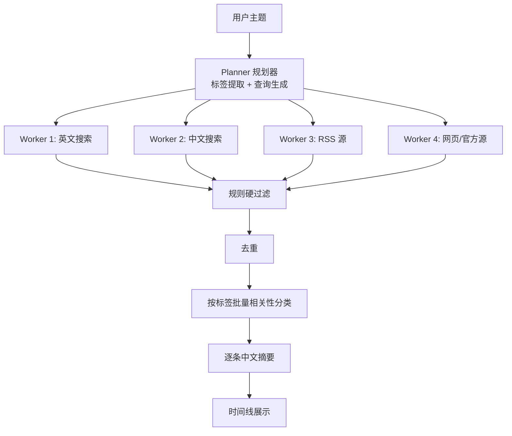

# Monitor Agent 设计说明

## 目标

做一个命令行/Textual 形式的信息监控 agent。用户输入一个主题，例如「监控 OpenAI 最近的重要产品更新」，系统自动完成关键词/标签生成、多通道抓取、规则过滤、去重、相关性分类、中文摘要，并按时间线展示。本阶段为单次运行，不持久化历史。

## 架构

采用 algocode 风格的 fan-out 多 Worker 编排，把 Worker 的“优化路径”重新定义为“采集通道”。采集前先做标签提取，采集后按标签批量分类。



- Planner 先提取结构化兴趣标签，再按标签生成中英文查询词和种子 URL。
- 每个采集 Worker 独立运行有界工具循环，只负责搜索/抓取并产出结构化 `SourceItem`。
- 规则硬过滤、去重、时间线不交给 LLM，保证稳定可复现。
- 相关性判断采用 TrendRadar 的“按标签批量分类”，返回 `tag_id + score`。

## 技术栈

- Python 3.13
- Textual：终端界面
- OpenAI SDK：OpenAI 兼容 LLM
- tavily-python：搜索
- feedparser：RSS/Atom/JSON Feed
- httpx + trafilatura / BeautifulSoup：网页抓取和正文提取
- rapidfuzz：标题相似度去重
- pytest：测试

## 功能对标

| 模块 | 参考项目 | 借鉴内容 |
|------|----------|----------|
| 工程组织、配置、LLM 客户端、工具循环、TUI | algocode | `src/` 结构、`Settings`、流式 tool calling、`on_event` |
| Tavily 搜索 | BettaFish | 多参数搜索封装、重试、结构化结果 |
| 查询生成 | BettaFish | `FirstSearchNode` 的 JSON 查询生成 |
| JSON 清洗 | BettaFish | `clean_json_tags`、`fix_incomplete_json` 等 |
| 去重 | worldmonitor + TrendRadar | 标题归一化、URL 去重、加权选主 |
| 时间线 | worldmonitor | 时间倒序、缺失时间排后、按天分组 |
| 标签提取 | TrendRadar | `extract_prompt.txt` 的标签抽取 |
| 相关性分类 | TrendRadar | `AI Filter Pipeline` 的批量标签分类 |
| 规则硬过滤 | TrendRadar | `frequency.py` 的关键词/正则/排除规则 |
| RSS 抓取 | TrendRadar + worldmonitor | RSS/Atom/JSON Feed 解析、feed 配置、失败降级 |
| 摘要 | GitHubSentinel / BettaFish | 聚合结果交给 LLM，失败降级到 snippet |

## 目录结构

```text
monitor-agent/
  .env.example
  requirements.txt
  README.md
  run_monitor.cmd
  src/
    __init__.py
    config.py
    prompts.py
    models.py
    infrastructure/
      __init__.py
      llm_client.py
    sources/
      __init__.py
      base.py
      tavily.py
      rss.py
      web.py
    agent/
      __init__.py
      collector.py
    pipeline/
      __init__.py
      planner.py
      keyword_filter.py
      dedup.py
      relevance.py
      summary.py
      timeline.py
      orchestrator.py
    tui/
      __init__.py
      tui_app.py
  tests/
    test_config.py
    test_json_utils.py
    test_dedup.py
    test_rss.py
    test_keyword_filter.py
    test_collector.py
    test_pipeline.py
```

## 数据模型

核心使用 `dataclass`：

```python
@dataclass
class InterestTag:
    id: int
    tag: str
    description: str = ""
    priority: int = 0

@dataclass
class QueryPlan:
    topic: str
    tags: list[InterestTag] = field(default_factory=list)
    keywords: list[str] = field(default_factory=list)
    english_queries: list[str] = field(default_factory=list)
    chinese_queries: list[str] = field(default_factory=list)
    seed_urls: list[str] = field(default_factory=list)

@dataclass
class SourceItem:
    title: str
    url: str
    source: str
    published_at: datetime | None
    published_missing: bool = True
    snippet: str = ""
    content: str = ""
    tier: int = 4
    matched_tag: str = ""
    relevance: float | None = None
    relevance_reason: str = ""
    summary_zh: str = ""
    extra_sources: list[str] = field(default_factory=list)
```

其他结构：

- `CollectionChannel`：通道 id、名称、来源类型、查询词列表、URL 列表。
- `ToolOutput`：给 LLM 的 `text` 和给流水线的 `items`。
- `MonitorSession`：一次运行的状态容器，类似 algocode 的 `TaskSession`。

## 流水线

1. `plan(topic)`：LLM 提取兴趣标签，并生成中英文查询词和种子 URL。
2. `collect(plan)`：并行运行 2-4 个 CollectorWorker。
3. `hard_filter(items, plan)`：按规则词表做快速硬过滤，减少 LLM 调用。
4. `deduplicate(items)`：标题归一化 + URL 去重 + 同标签内去重。
5. `classify(plan.tags, items)`：批量 LLM 分类，每条返回 `tag_id + score`，低于阈值丢弃。
6. `summarize(items)`：逐条生成中文摘要，失败降级到 snippet。
7. `build_timeline(items)`：按发布时间倒序，缺失时间排后，按天分组。
8. Textual 展示，支持按标签分组。

## 智能体循环

采集 Worker 使用 algocode 的手写流式工具循环：

```text
while 轮数未耗尽:
    stream LLM with tools
    累积 content 和 tool_calls
    如果没有 tool_calls: 结束
    执行工具，得到 text + SourceItem
    把 text 作为 tool 消息回传
    把 SourceItem 存入 collector.collected
    进入下一轮
```

工具：

- `search_web(query)`：Tavily 搜索。
- `fetch_rss(url)`：抓取 RSS/Atom/JSON Feed。
- `fetch_web(url)`：抓取网页并提取正文。

限制：

- 最大工具轮数、最大搜索次数。
- 相同工具 + 相同参数只真实调用一次。
- 单个来源失败不影响其他通道。

## 提示词

提示词使用英文，关键术语保留中英对照，最终要求中文输出。

标签提取阶段：

```text
# Identity
You are an interest-tag extraction specialist.

# Task
Extract 5-20 concise tags from the user topic. Each tag has a short name and
a description that includes concrete keywords.

# Output
Return only JSON:
{"tags": [{"tag": "OpenAI product", "description": "GPT, ChatGPT, API releases"}]}
```

相关性分类阶段：

```text
# Identity
You are a news classification specialist.

# Task
For each news title, choose the single most relevant tag and give a score
from 0.0 to 1.0. Skip items that match no tag.

# Output
Return only JSON:
[{"id": 0, "tag_id": 1, "score": 0.92}]
```

摘要阶段：

```text
Write one concise Simplified Chinese summary for each item.
Do not invent facts. Fall back to the provided snippet if needed.
```

## 配置

`.env` 示例：

```text
LLM_API_KEY=
LLM_BASE_URL=
LLM_MODEL=

TAVILY_API_KEY=
RSS_FEEDS=
KEYWORD_FILTER_FILE=

MAX_SEARCH_ROUNDS=4
MAX_WEB_SEARCHES=6
MAX_RESULTS_PER_SOURCE=8
RELEVANCE_THRESHOLD=0.6
CLASSIFY_BATCH_SIZE=20
```

RSS 源和关键词过滤文件可暂时留空，Tavily 和网页抓取作为主要通道。

## 错误处理

- Tavily 失败时降级到 RSS 和网页抓取。
- 标签提取失败时用主题原文作为兜底查询。
- LLM 相关性或摘要失败时使用 snippet 或原始标题。
- 单个 Worker 异常转换为空结果，不拖垮整体。
- 无结果时界面明确提示。

## 去重策略

采用五层去重，质量优先，避免误合并不同事件。

```text
URL/GUID 归一化
  → 精确重复移除
  → 标题归一化 + rapidfuzz 近似去重
  → 正文 4-gram shingling + Jaccard 近似去重
  → 加权选择主条目，合并 extra_sources
```

- URL 归一化：解码、去 fragment、域名路径小写、去掉 `utm_*`、查询参数排序、末尾 `/` 归一化。
- RSS 条目优先使用 `guid`，没有时使用归一化 URL。
- 标题近似阈值：`token_set_ratio >= 90`。
- 正文近似阈值：`Jaccard >= 0.88`。
- 主条目权重：来源 tier + 时间新鲜度 + 内容完整度 + Tavily score。

## 默认参数

| 参数 | 默认值 |
|------|--------|
| 标签数量 | 5-12 |
| 标题近似阈值 | 0.90 |
| 正文近似阈值 | 0.88 |
| 规则硬过滤 | 关闭 |
| 相关性阈值 | 0.6 |
| 分类批量大小 | 20 |
| 摘要长度 | 1-2 句中文 |

## 测试

- `test_dedup.py`：标题归一化、URL 去重、主条目选择。
- `test_rss.py`：RSS/Atom/JSON Feed 解析、日期缺失标记。
- `test_keyword_filter.py`：关键词/正则/排除规则。
- `test_collector.py`：工具分发、轮次和搜索预算。
- `test_pipeline.py`：使用 mock LLM/client 跑通端到端。
